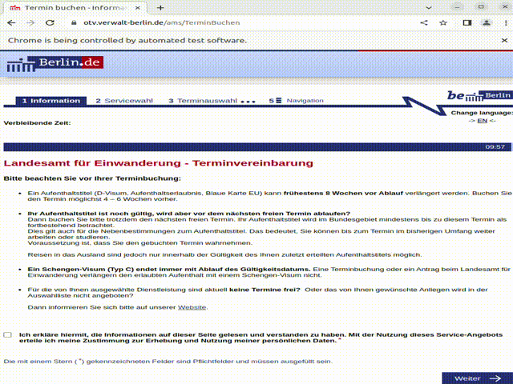

# berlin-visa-termin-macro

A Selenium-based bot designed to help individuals secure an appointment with the Landesamt für Einwanderung, commonly known as the Ausländerbehörde, in Berlin.

This project was initiated in response to the challenges many face when trying to book appointments through conventional means, and as a counteraction against those exploiting the scarcity of appointments for financial gain. By providing this bot as an open-source solution, we aim to level the playing field and empower all individuals, regardless of their technical expertise.

## How It Works

The bot utilizes Selenium to automate the process of checking for available appointments on the [Landesamt für Einwanderung's booking page](https://otv.verwalt-berlin.de/ams/TerminBuchen). When an appointment becomes available, the bot can notify the user via a Slack message and an audible alert, allowing them to take immediate action.

### Prerequisites

To use this bot, you'll need:
- Python 3.x
- pip
- virtualenv (recommended)

or

- Docker
- Docker compose

### Setup Instructions

1. Clone the repository to your local machine:
   ```
   git clone https://github.com/ccomkhj/berlin-auslanderbehorde-termin-macro.git
   ```
2. Create and activate a virtual environment:
   ```
   virtualenv venv
   source venv/bin/activate  # On Windows use `venv\Scripts\activate`
   ```
3. Install the required Python packages:
   ```
   pip install -r requirements.txt
   ```
4. (if chromedriver error happens after pip installation) Download the appropriate version of `chromedriver` for your system from [here](https://chromedriver.chromium.org/downloads) and place it in the project directory.
5. Adjust configurations in `config.yaml` and `macro_termin.py` to match your personal details and preferences. 

### Running the Bot

1. Running locally
```
python3 macro_termin.py
```

2. Running using docker
```
sh docker_run.sh
```
When you read the slack message or audio, go to the remote tab.
[http://localhost:7900/?autoconnect=1&resize=scale&password=secret](http://localhost:7900/?autoconnect=1&resize=scale&password=secret)

Congratulation, you find a time slot! But you should hurry to book it.
Because of Bot-checker, automated booking is not available.

Example of success.
```
macro-berlin-termin-1  | 2024-03-10 13:11:51,270        INFO       Ticking off agreement
macro-berlin-termin-1  | 2024-03-10 13:11:57,400        INFO       Fill out form
macro-berlin-termin-1  | 2024-03-10 13:12:00,147        INFO       Clicked on the label with text 'Aufenthaltstitel - beantragen' successfully.
macro-berlin-termin-1  | 2024-03-10 13:12:01,213        INFO       Clicked on the label with text 'Familiäre Gründe' successfully.
macro-berlin-termin-1  | 2024-03-10 13:12:02,286        INFO       Clicked on the label with text 'Aufenthaltserlaubnis für Ehepartner und Kinder von Inhabern einer Blauen Karte EU (§§ 29-32)' successfully.
macro-berlin-termin-1  | 2024-03-10 13:12:13,511        INFO       !!!SUCCESS - do not close the window!!!!
```


## Configuration and Customization

The bot's behavior can be configured by modifying the `config.yaml` file. This includes setting personal information, wait times, and the sound file for alerts. For detailed customization, users can modify the source code as per their needs.

## Acknowledgments

The automation script requires `chromedriver` and Selenium. Refer to the official [Selenium documentation](https://www.selenium.dev/documentation/en/) for more information on web automation.

## License

This project is licensed under the AGPL-3.0 license - see the LICENSE file for details.

### Disclaimer

I was motivated by two repositories.
- [Java Bot with a few bugs](https://github.com/yilmaznaslan/berlin-auslaenderbehorde-termin-bot )
- [Python Bot without configuration](https://github.com/capital-G/berlin-auslanderbehorde-termin-bot )

Please use this bot responsibly. The developers are not responsible for any misuse of this software or any violations of terms and conditions of the Landesamt für Einwanderung booking system.


